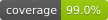

# nwcommitaverages

Contact: numbworks@gmail.com

## Introduction

From the documentation:

> `nwcommitaverages` is a CLI application designed to calculate the average time between Git commits.

## Getting started

- [Documentation](docs/docs-nwcommitaverages.md)

## Other links

- [LICENSE](LICENSE)